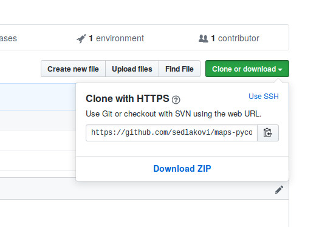

# [Put Your Data on the Map with Plotly (and Ease)][pycon-workshop]

Materials for workshop at Pycon.cz '19 Ostrava. Brought to you by
[**Sedlakovi.org**][sedlakovi].


## Presentations

You'll find slides linked here.

## Cheat sheets

- [Plot.ly](https://github.com/sedlakovi/interactive-dashboards/blob/master/docs/plotly_cheat_sheet.pdf)


## Data sources

- World happiness report ([Kaggle][happy-kaggle])

## Useful links

- [Charts in Plotly](https://plot.ly/python/basic-charts/)
- [Folium](https://python-visualization.github.io/folium/)

## Installation

**Important note: size of the repository is big (approx. 100 MB), so please download it at home.**

For this workshop, you'll need:

- Python **3**
- Pandas (for data analysis)
- Jupyter Notebook (for interactive work)
- Matplotlib and Plot.ly (they draw charts)
- Folium (draws maps better than Plotly)
- XLRD (reads Excel files - just in case)
- geojson (to edit GeoJSON file)

If you already have Python 3 (plain or Anaconda), just install these PIP packages:

```
jupyter pandas matplotlib plotly folium xlrd geojson
```

If not, follow next steps.

### Steps

#### 1.

Install Python **3**. You can follow [the tutorial at realpython.com][python-install].

**Important** - If your Windows user name contains spaces or non-english characters
(háčky, čárky, кириллица), choose "Customize installation" and choose path that will be
outside of "C:\Users\Your name". Otherwise, some packages might not install properly.

Pozn.: In Linux, you'll need to install `pip` extra. In Ubuntu, use
`sudo apt install python3-pip`.

#### 2.

In console, run

    pip3 install --upgrade jupyter pandas matplotlib plotly folium xlrd geojson

_Tip: In Windows, you can start console by pressing the Win key, then typing cmd. You copy
into the console with right mouse button._

Installation should finish with words `Successfully installed` and a list of many packages
and their versions.


If the installation finishes differently, you're probably missing something in system and
you need to install it. The error message will contain some hints that you can google.

#### 3. Just before the workshop

Check out the workshop repository (if you have Git)

```
git clone https://github.com/sedlakovi/maps-pycon-2019.git
```

Or download it (if you don't have Git). Look for "Clone or download" button at
[github.com/sedlakovi/maps-pycon-2019](https://github.com/sedlakovi/maps-pycon-2019) and
choose "Download ZIP".




[pycon-workshop]: https://cz.pycon.org/2019/programme/workshops/13/#main
[sedlakovi]: https://www.sedlakovi.org
[python-install]: https://realpython.com/installing-python/
[happy-kaggle]: https://www.kaggle.com/unsdsn/world-happiness
[ufo-github]: https://github.com/planetsig/ufo-reports
